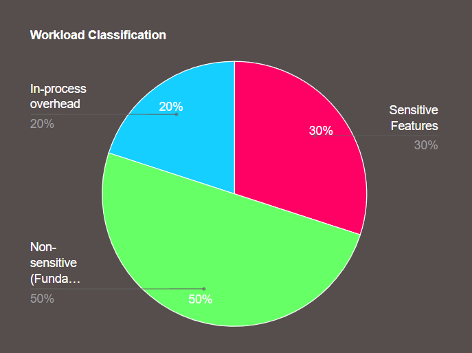

# Portfolio Website
An interactive, easily-readable, visually enhanced and sophisticated developer portfolio that i created using my pre-existing knowledge of web-based tools, libraries and the fundamental JavaScript in combination with effective prompting, debugging, and code reviewing. This website is meant to be used as a showcase for my future projects. 


## Live Demo
🌐 Live Website: https://sudhanshu-portfolio-website.vercel.app/

## Overview
### Why?
This portfolio website was created out of necessity for showcasing my projects. I have been working on a project that could come handy for beginner developers like me who might want to stand out a little from the general mass of Computer Science graduates. Since most of the creations of junior developers such as me are not large-scale enough to warrant a separate deployment, a portfolio website is the next logical choice.

### How?
Rather than building it through the traditional method, i opted for the modern and more in-demand methodology which prioritises both efficiency and optimality on equal terms. 

To maximise the efficiency and deliver the project as soon as possible, i separated the workload into 2 separate parts. First part comprised of the skeletal features i.e. those features which are fundamental and generally insensitive to external factors such as user preferences, development environment, purpose of development, etc.. The other part comprised of the more sensitive features such as visuals. And apart from these were the inevitable tasks such as debugging, code review and optimisation. 



To be able to give the due attention to the latter parts, I completely automated the tasks lying in the first part, to achieve which, I utilized two LLMs and categorized them as Primary and Secondary based on what task they would carry out. 

1. Primary LLM
* Gemini 3.5 Flash
* LLM of choice to generate the code for building the website skeleton
* Main reason behind the choice was the relatively higher memory capacity of the LLM

2. Secondary LLM
* GPT 5.2 Instant
* For quick workarounds to persistent limitations and optimisation of prompts
* This model is particularly adept at quick, thorough checks and comprehension

The working environment was Google AI studio due to its highly user-friendly interface, layout, and exemplary features such as easy version restoration, remixing, etc.. 
Although not as well acquainted with TypeScript as i would have liked to be, I used my prior experience building responsive web pages with JavaScript to debug a lot of problems, with respect to the dimensional integrity of the visual elements, that crept up primarily due to the existence of the 3D tablet and its movement with respect to the pages.

Throughout the development phase, all of the 3 aforementioned stages overlapped amongst themselves leading to the requirement of relatively higher focus on the otherwise ignorable details. Pair that with the regular hallucinations of the LLMs, the entire process was meticulous and far more detail-oriented than it is being given credit for. 

This methodology reflects my approach to engineering:

* Debugging-driven development
* Rapid prototyping with AI assistance
* Aesthetic and pragmatic UI
* Continuous and incremental iterative development

This website is going to be hosting a lot of my future works and will be the center of all of my experiments for the forseeable future. 

## Features
### Interactive User Interface
* Custom UI inspired by other portfolios across the internet
* Interactive 3D tablet with audio-visual Haptics to add a layer of creativity
* Smooth transition paired with fading visuals to accomodate visitors with motion sickness
* Both Hamburger and Kebab Menu for instant access to different sections of the page

### Professional Profile
* Developer introduction and background
* Skills visualization
* Project showcase section
* Downloadable resume
* In-built contact form to directly contact the developer

### Certifications
* Internship certificate display window for credential verification
* Dedicated certificate viewer for careful inspection

### Responsive Design
* Desktop and Mobile-friendly layouts
* Modern component-based architecture

### Deployment Pipeline
* Local Development Environment
* Dual-layer synchronisation (Local-> GitHub -> Vercel)
* Git-based version control
* Github repository integration
* Automated Vercel Deployments

## Tech Stack
### Frontend
* React 19
* TypeScript
* Vite

### Styling
* Tailwind CSS

### Development Tools
* VS Code
* Git
* Github
* Vercel 

### AI Assistance
* Gemini 3.5 Flash
* GPT 5.2 Instant
* Google AI Studio

## Project Structure
```text
Portfolio-Website/ 
├── public/ # Static assets (PDFs, certificates, images) 
├── src/ # Application source code 
│ ├── components/ # Reusable UI components 
│ ├── hooks/ # Custom React hooks 
│ ├── App.tsx # Main application component 
│ └── main.tsx # React entry point 
├── package.json # Project metadata and dependencies 
├── vite.config.ts # Vite configuration 
└── README.md # Project documentation
```

## Getting Started

### Clone the Repository
git clone https://github.com/ShudhanshuMishra38/Portfolio-Website.git
### Navigate to the Project
cd Portfolio-Website
### Install Dependencies
npm install
### Start Development Server
npm run dev
### Build for Production
npm run build

## What i learned 

* Efficient prompting methodologies to optimise output accuracy and reduce hallucinations
* Targetted debugging 
* Version control with Git, GitHub
* Production deployment with Vercel
* Iterative UI/UX refinement
* Managing deployment pipelines
* Static asset handling in Vite
* Time management and development under severe constraints of both time and resources

## Future Improvements
Ordered in terms of priority: 

* Responsiveness for screens having dimensions equivalent to that of a Tablet
* Integrating a live AI assistant as a guide for the visitors 
* Separate pages for the live demonstration of projects and their workings with a brief explanation of the codebase alongwith their snippets.
* Adding further operations in the 3D tablet such as web surfing- extent subject to the optimisation of the performance parameters of the website
* Background revamp- possibly incorporating pixel-based aesthetic images
* A Blog page and a "Buy me a coffee" feature

## Deployment

The project is deployed using Vercel. It redeploys automatically whenever i push changes to the main branch.

## Author

### Sudhanshu Shekhar Mishra

* GitHub: https://github.com/ShudhanshuMishra38
* Portfolio: https://sudhanshu-portfolio-website.vercel.app/

If you found this project interesting, feel free to explore the codebase, open an issue, or connect with me.